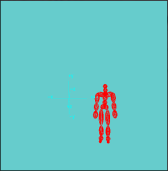
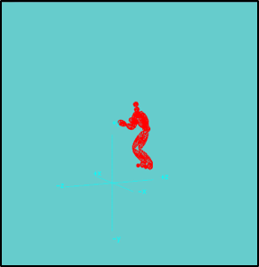
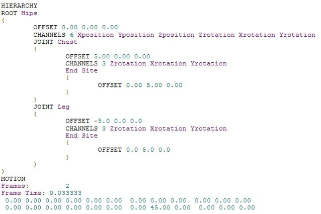
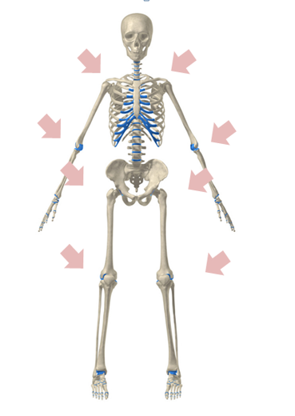
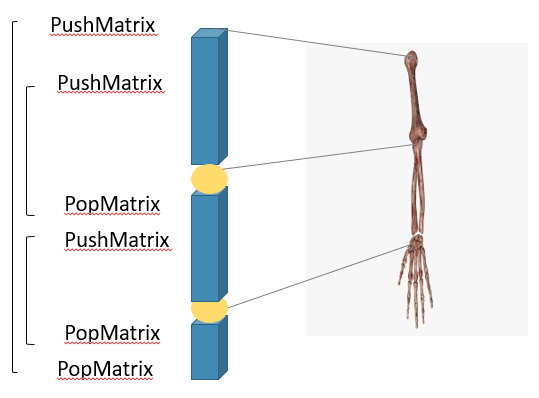
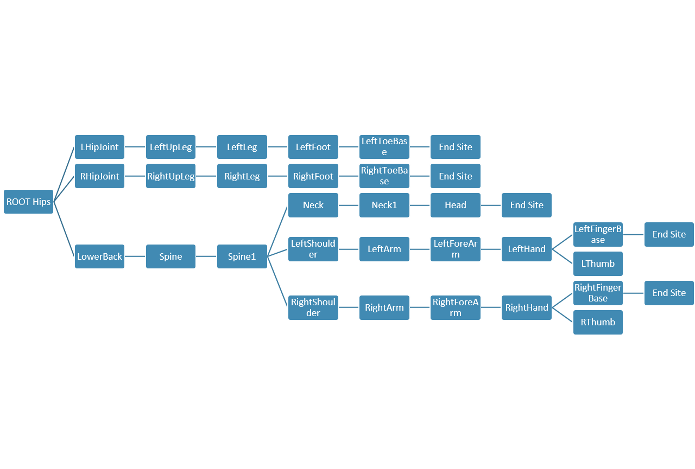

컴퓨터 그래픽스 이론을 기초로 하여 직접 팀원을 모집, 주제를 선정한 프로젝트 입니다. 
초기 목표는 모션 캡쳐 장비를 직접 신체에 부착하여 모션 데이터를 수집하는 것이었지만,
장비 대여 및 기간의 한계가 있어, 기존의 BVH 포맷 데이터를 표현하는 방향으로 진행하였습니다.

| 기타 | 설명                                    | 
| :----- | :--------------------------------------- | 
| 인원      | IT융합응용공학 4학년 4명  | 
| 기간      | 2학기  | 
| 참고도서      | OpenGL로 배우는 3차원 컴퓨터 그래픽스(한빛아카데미)  OpenGL SUPER BIBLE 3(정보문화사)|  
|Dependencies      | C++ OpenGL | 

>> 참고도서
OpenGL로 배우는 3차원 컴퓨터 그래픽스(한빛아카데미) 
OpenGL SUPER BIBLE 3(정보문화사)
>> 
## OpenGL을 이용한 BVH 모션캡쳐

##### BVH란? 
Biovision사에서 만든 모션 캡쳐 데이터 파일로, HEADER 영역과 MOTION 영역으로 나누어져 있습니다.
- HEADER
  - HIERARCHY
  - ROOT: 전체 구조의 기본이 되며 한 파일당 하나의 ROOT만 존재
    - OFFSET: 이후에 ‘{‘ 다음에 오며, X, Y, Z로 이루어져 있으며 부모로부터의 길이와 방향을 나타냄
    - CHANNELS: OFFSET다음에 오며 채널 개수와 type을 표현, Z/X/Y rotation 순으로 입력되어 있음
    - JOINT: 관절을 나타내며 연결된 일련의 객체의 root 역할을 하며, 재귀 구조가 기작되는 부분
  - END SITE: 재귀 구조의 마지막을 나타냄
- MOTION    

##### 설계

실제 사람의 뼈가 움직이는 원리를 이용하여 **관절(joint)**, 그리고 joint와 joint 사이, joint와 end site 사이의 길이
즉, 팔과 다리는 offset 으료 표현됩니다. 
하나의 join에 종속된 하위 객체들은 상위 join가 움직이면 함께 움직이며, 
이러한 움직임을 stack에 저장하여 구현하였습니다.  

##### 전체 계층 구조

