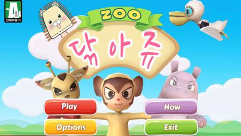
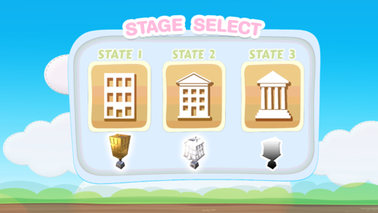
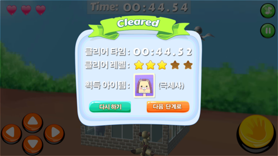
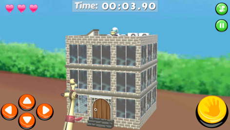
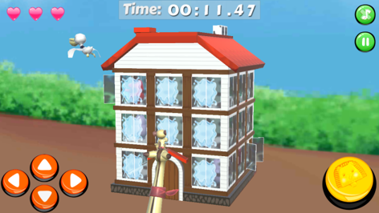
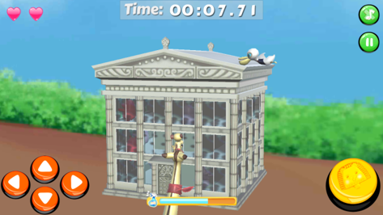

2015년 부산 게임 아카데미 모바일 게임 개발 과정을 수료과정 프로젝트 입니다. 

| 기타 | 설명                                    | 
| :----- | :--------------------------------------- | 
| 인원      | 개발 3명 + 디자인 3명  | 
| 기간      | 2개월  | 
| 참고도서      | OpenGL로 배우는 3차원 컴퓨터 그래픽스(한빛아카데미)  OpenGL SUPER BIBLE 3(정보문화사)|  
|Dependencies      | C# Unity | 

## 닦아쥬
[▶동영상](https://drive.google.com/file/d/0B-9fnGL9jjaMdDAtVWptRWNmQzA/view?resourcekey=0-T1KEq4LqigICfq2yPH0hxQ)
##### 게임 컨셉
창문닦기 게임에서 아이디어를 얻어 귀여운 원숭이(player)가 기린의 등에 올라타 하마(npc)를 피해 각 건물(stage)의 창문을 닦는 게임입니다. 게임 도중 물풍선, 수건 종류와 같은 item을 추가해 재미 요소를 주었습니다. 

##### 설계
- GameManager: 게임 초기화 및 전체 오브젝트 생성/관리
  - Awake()
  - Start()
  - Update(): 프레임마다 life, window count 
  - InitState1(), InitState2(), InitState3(): stage 생성(3x3/3x4 배열)
  - InitNPC(): player와 마주보도록 위치 지정/이동경로 설정
  - Transform returnToWindow(): window의 배열 위치 및 flag
  - GameObject returnWindow(): window 객체 리턴
  - clearWindow()
- Player
  - Start(): player 초기화/GameManager 클래스 및 컴포넌트 선언
  - Update(): 프레임마다 키 입력 처리
  - OnTriggerEnter()
  - InitMonkeyPos(): player 위치 초기화
  - StateAttack()
  - IEnumerator playerDie
  - MovePlayer(): 키보드(화살표) 입력 값을 받아와 player 이동, 문에 가로막히면 이동 불가
  - WinClean()
- Npc
  - Start(): npc 초기화(각 stage별로 speed, material 다르게 설정)
  - Update(): 코루틴을 이용해 MoveNpc() 를 계속 호출함/목적지를 랜덤으로 하여 npc의 움직임을 제어함
  - InitNpcPos()
  - IEnumerator MoveNpc
  - IEnumerator MoveFloor
  - IEnumerator MoveCol

##### 설계

실제 사람의 뼈가 움직이는 원리를 이용하여 **관절(joint)**, 그리고 joint와 joint 사이, joint와 end site 사이의 길이
즉, 팔과 다리는 offset 으료 표현됩니다. 
하나의 join에 종속된 하위 객체들은 상위 join가 움직이면 함께 움직이며, 
이러한 움직임을 stack에 저장하여 구현하였습니다.  

##### 전체 계층 구조

