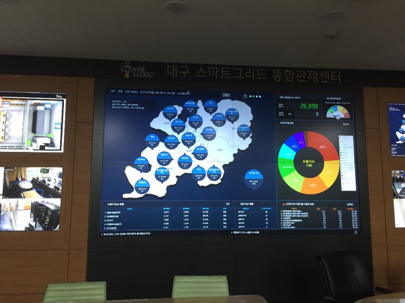
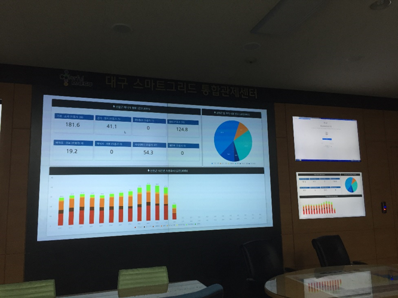
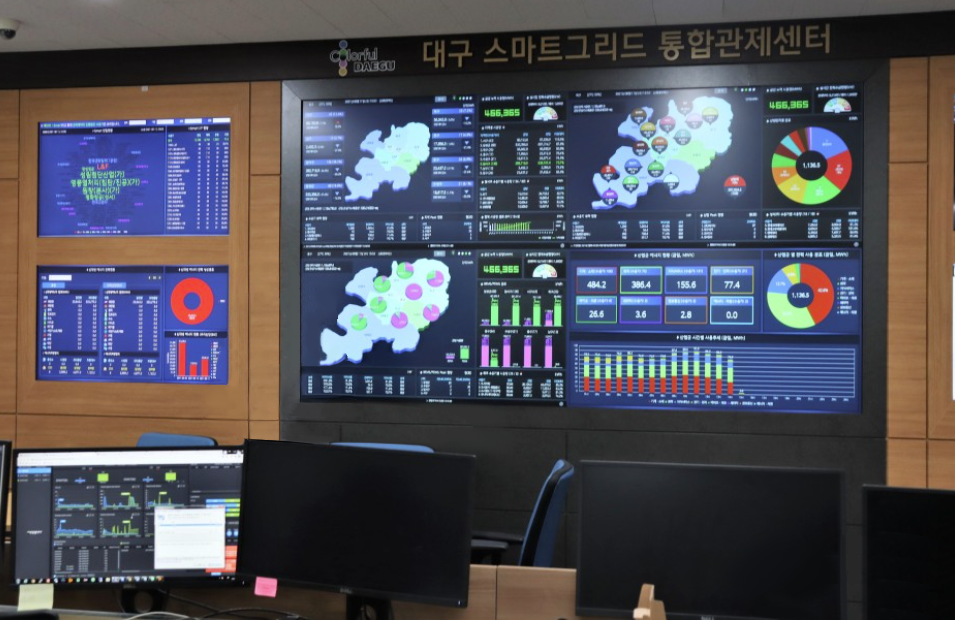

대구광역시 내 공공기관 및 에너지 다소비 기업의 업체/시간대/공단 단위 모니터링 즉, 스마트 그리드 시스템을 통해 전력 사용량 절감을 목표로 한 지방자치단체의 에너지 사업 입니다. 

| 상세 | 설명                                    | 
| :----- | :--------------------------------------- | 
| 인원      | 개발 20+명 + DBA 1명  | 
| 기간      | 1년  | 
|Dependencies      | Spring framework Java Script(Angular.js, nginx) bootstrap(CSS) tibero(RDBMS) rMate(Chart UI) 크리스탈 리포트 MagGauge(DB성능관리) 한전I-SMART API Jenkins
| 

##### Before project starts
- 약 300+여개 수용가 영입 목표
  - 각 수용가의 다양한 모니터 환경에 맞추기 위한 웹 접근성 준수와 반응형 웹 구축
  - 수용가 별 권한 관리
- 전력량 수집 
  - 한전 I-SMART (API)
  - 누리텔레콤
- 요금량 리포트 발행
  - 크리스탈 리포트

##### 개발 내용
- 전력 모니터링 화면 개발
- 데이터 시각화 Chart, Grid 
- 전력 요금 계산을 위한 API 데이터 보정 
- peak 혹은 비정상 에너지 alert
