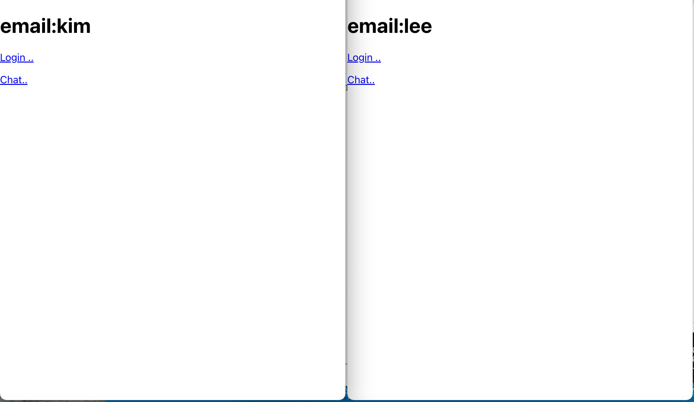
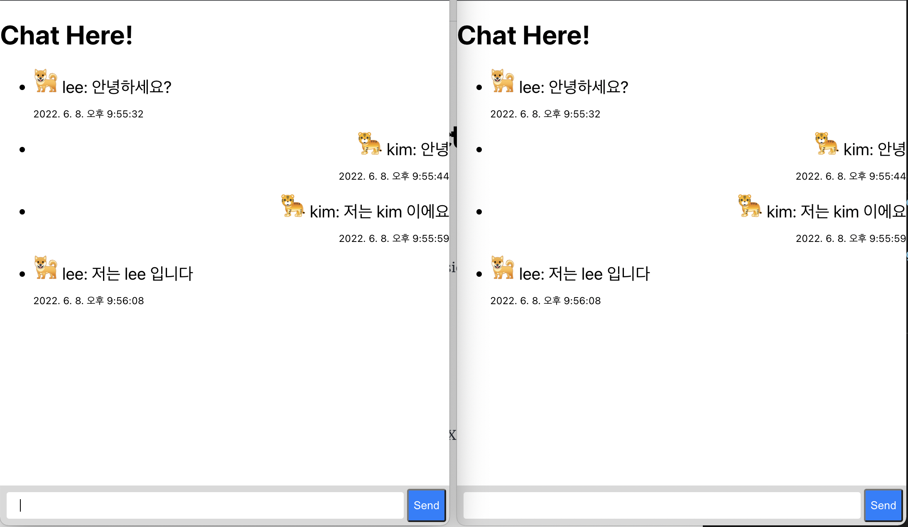
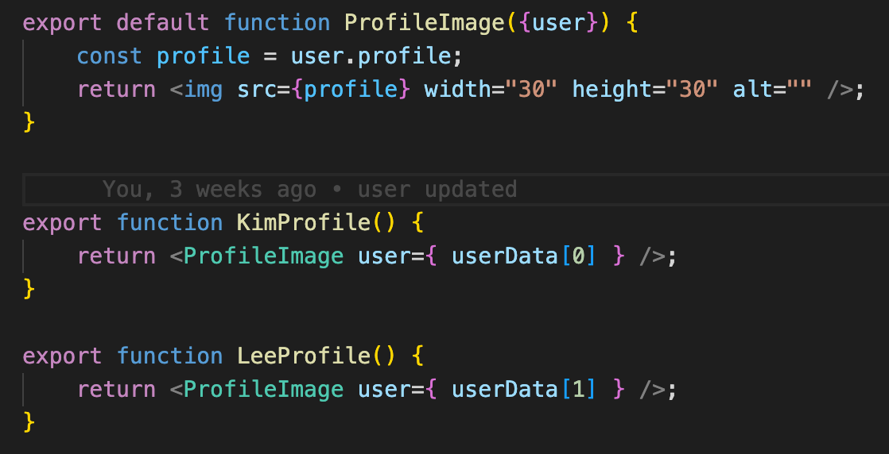

react와 socket으로 구현한 채팅 프로그램으로, 회원 인증(session), 채팅 기능을 갖고 있습니다.
평소 middle ware를 직접 다룰 기회가 적었기 때문에, study 목적의 toy project 입니다. 




##### Before project starts 
- UI 제작(css) 보다 기능 구현에 중점
- 패키지, 라이브러리 서칭


##### Project folder structure
``` bash 
practice-web-chat
├── src
│   ├── Index.js            ---> react Index.js file
│   ├── App.js              ---> react App.js file
│   ├── Login.js            ---> processing Login 
│   └── Chat.js             ---> delivering message
└── server.js               ---> express(socket.io, default userData setting, passport ...)
```

##### Dependencies 
Dependence             |Version
-----------------------|-------
express                | ^4.17.3
passport               | ^0.5.2
react                  | ^18.0.0
socket.io              | ^4.5.0
cors                   | ^2.8.5
proxy                  |
nodemon                |


##### API Specifications

| Action | API      | Method     | Success Response | Fail Response  |
| :----- | :------- | :--------- | :--------------- | :------------- | 
| get    | `*`      | isAuthenticated | user_info   | null           |
| post   | `/login` | passport.authenticate | res.json(eUser) | null      |


##### TODO
- [x] 로그인 시 메인화면&채팅화면 닉네임 표시 -> Route Link 의 state에 저장, props&useState로 사용
- [x] window localStorage 사용 -> 이전 대화 내역 불러오기(useEffect)
- [x] default user Data -> 유저마다 profile 지정

- [x] 미 로그인 시 redirect
- [x] nodemon 사용하여 react app <> express app 동시 구동
    - [x] proxy, cors 등의 보안옵션
- [x] 기타 보안옵션(credentials)
- [x] 채팅 송신 시 emit, 수신 시 broadcast (socket.io)